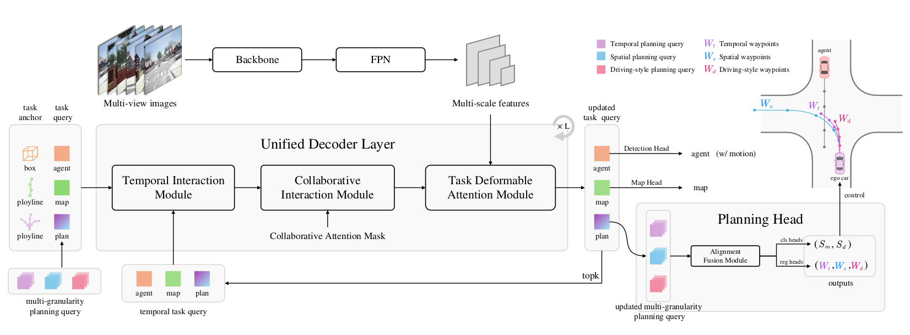
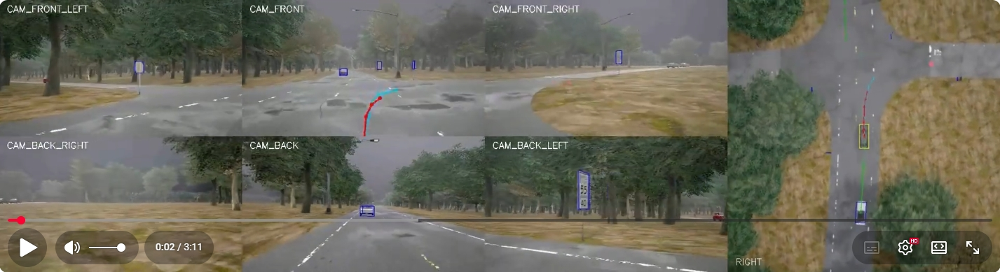

<div align="center">
<h1>HiP-AD</h1>
<h3>HiP-AD: Hierarchical and Multi-Granularity Planning with Deformable Attention
for Autonomous Driving in a Single Decoder</h3>
<h3 align="center">ICCV 2025</h3>
<a href="https://arxiv.org/abs/2503.08612"></a>
</div>


## Introduction



- We propose a **multi-granularity planning** query representation that integrates various characteristics of waypoints to enhance the diversity and receptive field of the planning trajectory, enabling additional supervision and precise control in a closed-loop system.
- We propose a **planning deformable attention** mechanism that explicitly utilizes the geometric context of the planning trajectory, enabling dynamic retrieving image features from the physical neighborhoods of waypoints to learn sparse scene representations.
- We propose a **unified decoder** where a **comprehensive interaction** is iteratively conducted on planning-perception and planning-images, making an effective exploration of end-to-end driving in both BEV and perspective view, respectively. 

## Visualization
a 3-minute YouTube video showcasing closed-test on CARLA

[](https://www.youtube.com/watch?v=SxjpHe98AHk)

## Results
Closed-loop evaluation results on Bench2Drive dataset

|      method      | Model  | Driving Score | Success Rate |                             config                             | ckpt |
|:----------------:|:------:|:-------------:|:------------:|:--------------------------------------------------------------:|:----:|
| DriveTransformer | E2E-AD |     63.46     |    35.01     |   |   |
|      ORION       |  VLM   |     77.74     |    54.62     |   |   |
|     SimLingo     |  VLM   |     85.07     |    67.27     |   |   |
|      HiP-AD      | E2E-AD |     86.77     |    69.09     | [config](projects/configs/hipad_b2d_stage2.py)  | [ckpt](https://github.com/nullmax-vision/HiP-AD/releases/download/weighs/hipad_stage2.pth)     |


## Getting started
1. [Installation](#installation)
2. [Data Preparation](#data-preparation)
3. [Training](#training)
4. [Evaluation](#evaluation)

### Installation
1. create environment
```bash
conda create -n hipad python=3.8 -y
conda activate hipad
pip install --upgrade pip
pip install torch==1.13.0+cu117 torchvision==0.14.0+cu117 torchaudio==0.13.0 --extra-index-url https://download.pytorch.org/whl/cu117
pip install -r requirements.txt
```

2. compile the deformable_aggregation op
```bash
cd projects/mmdet3d_plugin/ops
python setup.py develop
cd ../../../
```
### Data Preparation
1. download the [Bench2Drive](https://github.com/Thinklab-SJTU/Bench2Drive) [Base] dataset with the official [configuration](https://github.com/Thinklab-SJTU/Bench2DriveZoo/blob/uniad/vad/docs/DATA_PREP.md).
```bash
ln -s bench2drive_root ./data/bench2drive
```

2. create pkl files from data converter.
```bash
python ./tools/data_converter/bench2drive_converter.py
```

3. create npy files by using kmeans clustering.
```bash
bash ./tools/kmeans/kemans.sh
```

4. check the file structure as follows:
```
HiP-AD/
├── assets/
├── bench2drive/
├── ckpts/
├── data/
│   ├── bench2drive
│   │   ├── maps/
│   │   ├── v1/
│   ├── infos
│   │   ├── b2d_infos_train.pkl
│   │   ├── b2d_infos_val.pkl
│   │   ├── b2d_map_infos.pkl
│   ├── kmeans
│   │   ├── b2d_det_900.npy
│   │   ├── b2d_map_100.npy
│   │   ├── b2d_motion_6.npy
│   │   ├── b2d_plan_spat_6x8_2m.npy
│   │   ├── b2d_plan_spat_6x8_5m.npy
│   ├── splits
├── projects/
├── tools/
```

### Training
1. Configure the external AdaptDrive asset root. The configs derive `project_dir` from their own location and do not require source edits.
```bash
export ADAPTDRIVE_ASSET_ROOT=/path/to/AdaptDrive-assets
export HIPAD_STAGE1_CKPT=/path/to/hipad_b2d_stage1_checkpoint.pth
```

`HIPAD_STAGE1_CKPT` is required only when launching standalone stage-2 offline training. The expected ResNet-50 checkpoint is documented in `../docs/ASSETS.md`.

2. Training HiP-AD: stage1 and stage2 cost about 14h and 46h, respectively, on 8 Nvidia 4090 GPUs.
```bash
bash ./tools/dist_train.sh ./projects/configs/hipad_b2d_stage1.py 8 --no-validate
bash ./tools/dist_train.sh ./projects/configs/hipad_b2d_stage2.py 8 --no-validate
```

### Evaluation
**Open-Loop**
```bash
bash ./tools/dist_test.sh ./projects/configs/hipad_b2d_stage2.py /path/to/checkpoint.pth 8 --eval bbox
```

**Closed-Loop**

1. install CARLA 0.9.15
```bash
mkdir -p carla && cd carla
wget https://carla-releases.s3.us-east-005.backblazeb2.com/Linux/CARLA_0.9.15.tar.gz
wget https://carla-releases.s3.us-east-005.backblazeb2.com/Linux/AdditionalMaps_0.9.15.tar.gz

tar -xvf CARLA_0.9.15.tar.gz
cd Import && tar -xvf ../AdditionalMaps_0.9.15.tar.gz
cd .. && bash ImportAssets.sh

export CARLA_ROOT=YOUR_CARLA_PATH
echo "$CARLA_ROOT/PythonAPI/carla/dist/carla-0.9.15-py3.7-linux-x86_64.egg" >> $CONDA_PREFIX/lib/python3.8/site-packages/carla.pth
```

2. create multi-route splits
```bash
python ./bench2drive/tools/split_xml.py
```

3. Use the repository's canonical clean launcher. It accepts all machine-local paths through environment variables and writes results beneath `ADAPTDRIVE_RUN_ROOT`.
```bash
export PROJECT_ROOT=/path/to/AdaptDrive
export ADAPTDRIVE_ASSET_ROOT=/path/to/AdaptDrive-assets
export ADAPTDRIVE_RUN_ROOT=/path/to/AdaptDrive-runs
export CARLA_ROOT=/path/to/CARLA
export EXPERIMENT_ID=hipad_clean_eval
export HIPAD_BASE_CKPT=/path/to/hipad_base_checkpoint.pth

bash ./bench2drive/leaderboard/scripts/run_hipad_clean_local.sh
```

4. Evaluate the closed-loop results.
```bash
python ./bench2drive/tools/statistic_route_json.py
```

5. Create videos (optional).
```bash
python ./bench2drive/tools/generate_video.py -f /path/to/evaluation/images
```

## Acknowledgement
Thanks to these excellent open-source works:

[UniAD](https://github.com/OpenDriveLab/UniAD),
[VAD](https://github.com/hustvl/VAD),
[SparseDrive](https://github.com/swc-17/SparseDrive),
[SimLingo](https://github.com/RenzKa/simlingo),
[Bench2Drive](https://github.com/Thinklab-SJTU/Bench2Drive),
[MMDetection3D](https://github.com/open-mmlab/mmdetection3d)

## Citation
If this work is helpful to you, we would appreciate it if you could star and cite it.
```bibtex
@article{tang2025hipad,
  title={HiP-AD: Hierarchical and Multi-Granularity Planning with Deformable Attention for Autonomous Driving in a Single Decoder},
  author={Yingqi Tang and Zhuoran Xu and Zhaotie Meng and Erkang Cheng},
  journal={arXiv preprint arXiv:2503.08612},
  year={2025}
}
```
